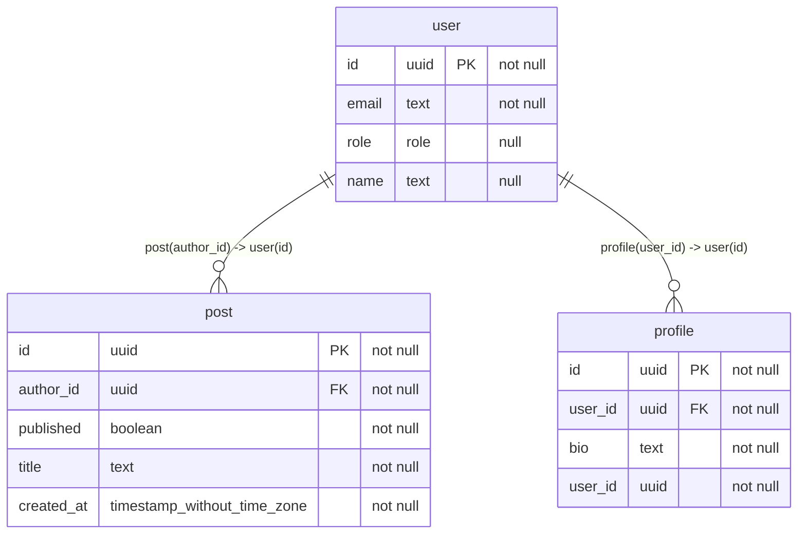

> **Note**
>
> Example of a markdown file generated with `pg-mermaid` from a PostgreSQL schema (cf. [schema.sql](schema.sql)).

---

## Diagram

## Indexes

### `post`

- `post_created_at_idx`
- `post_pkey`

### `profile`

- `profile_pkey`
- `profile_user_id_key`

### `user`

- `user_email_key`
- `user_pkey`
